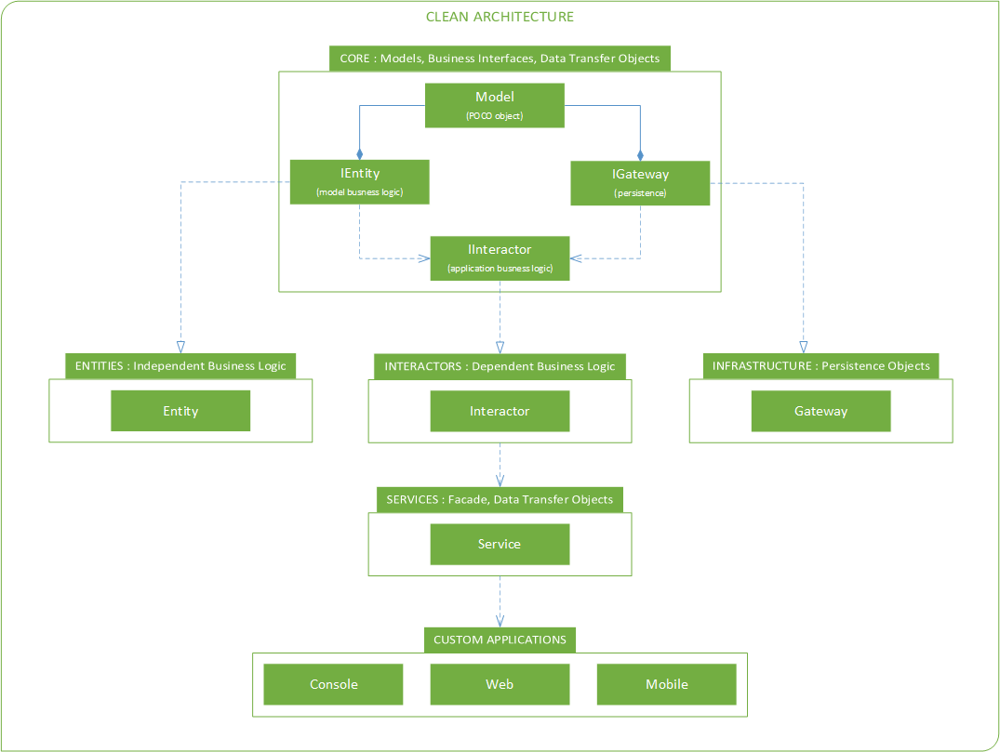

# CleanArch
My name is Vitalii Noga. This is my vision of the Clean Architecture implementation with using C#. 
The original principles of Clean Architecture by Uncle Bob Martin at https://8thlight.com/blog/uncle-bob/2012/08/13/the-clean-architecture.html.

## CleanArch implementation

Where: 
**Model** is POCO object with INotifyPropertyChanged implementation. Model is persistent. 
**IEntity/Entity** includes independent/model business logic. 
**IInteractor/Interactor** includes dependent/application business logic. 
**IGateway/Gateway** implements persistence data/model. 
**Service** is a facade/boundary between this architecture and custom applications. 

## CleanArch solution includes the following projects
- **Core** project includes models and business interfaces.
- **Entities** project implements business logic of models.
- **Interactors** project implements application business logic.
- **Infrastructure** project implements persistence data (model).
- **Services** project implements facade pattern and synchronous/asynchronous methods of interactors.
- **Loader** project includes dependency and auto mapper initializers.
- **Builder** project includes post build injection for POCO objects (added implementation of INotifyPropertyChanged event). 
- **Tests/TestEntities** project contains tests for testing entity implementations.
- **Tests/TestInteractors** project contains tests for testing interactor implementations.
- **Tests/TestInfrastructure** project contains tests for testing persistence objects/models.
- **Examples/ConsoleApp** project is console application for testing current implementation of Clean Architecture.

## Contacts
Email: vitalii.noga@gmail.com
